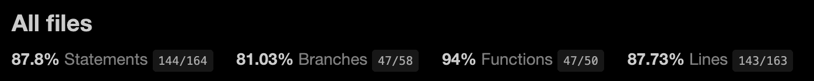

<h1 align="center">Engineering Manager - Technical Interview </h1>
 

  

 

# What is this?

As part of the technical interview process for the Engineering Manager position in Wolox, it is required to create a Sign-Up Form using ReactJS. To do that, I decided to use some specific extra technologies which include:

- TypeScript as a typed programming language.
- React ContextAPI as Data Management.
- Sass to pre-processing CSS styles.
- Formik to build the form and manage the logic.
- Yup to validations.
- React-select to create the autocomplete component.
- React-testing-library + Jest for Unit Tests.
- i18next as internationalization framework.
- React-Toastify for notifications
- And more!

Also, this project implements the **Airbnb React/JSX Style Guide** in order to follow the best practices and guidelines for generating quality code.

 

# NPM commands

Note: This project was bootstrapped with [Create React App](https://github.com/facebook/create-react-app).

## Available Scripts

### `npm start`

Runs the app in the development mode.\
Open [http://localhost:3000](http://localhost:3000) to view it in the browser.

The page will reload if you make edits.\
You will also see any lint errors in the console.

### `npm test`

Launches the test runner in the interactive watch mode.\
See the section about [running tests](https://facebook.github.io/create-react-app/docs/running-tests) for more information.

### `npm test:coverage`

Launches the test runner in the interactive watch mode and generates a coverage report in the "coverage/" folder.\
See the section about [coverage reporting](https://create-react-app.dev/docs/running-tests/#coverage-reporting) for more information.

### `npm eslint`

Check the code of the project taking as a main rule Airbnb + TypeScript Style Guide.

### `npm run build`

Builds the app for production to the `build` folder.\
It correctly bundles React in production mode and optimizes the build for the best performance.

The build is minified and the filenames include the hashes.\
Your app is ready to be deployed!

See the section about [deployment](https://facebook.github.io/create-react-app/docs/deployment) for more information.

### `npm run eject`

**Note: this is a one-way operation. Once you `eject`, you can’t go back!**

If you aren’t satisfied with the build tool and configuration choices, you can `eject` at any time. This command will remove the single build dependency from your project.

Instead, it will copy all the configuration files and the transitive dependencies (webpack, Babel, ESLint, etc) right into your project so you have full control over them. All of the commands except `eject` will still work, but they will point to the copied scripts so you can tweak them. At this point you’re on your own.

You don’t have to ever use `eject`. The curated feature set is suitable for small and middle deployments, and you shouldn’t feel obligated to use this feature. However we understand that this tool wouldn’t be useful if you couldn’t customize it when you are ready for it.

 

# Live Demo

In order to test this form easily, it was deployed in a static server. It is available on the following URL:

https://wolox-technical-test.netlify.app/

 

# Current Unit Test Coverage

Since I had some problems trying to test _react-select_ component (it is not "test friendly" at all), the coverage is not 100/100. Anyway, the numbers are pretty good.

 

  

 
 

# Final thoughts and potential improvements

This project was developed as a test, it wasn't the spirit to cover all the possible technologies and available patterns. Having said that, the following is a list of some potential improvements which could make it better:

- Increase the Unit Test Coverage.
- Create a unified folder with all the used mocks.
- Consider making integration tests.
- Implement an E2E solution.
- Implement SSR and run the project on a non-static server.
- Implement [React Router](https://reactrouter.com/) to handle Pages and make the code cleaner.
- Run/integrate SonarQube, Lighthouse or/and other tools to inspect the code quality and the performance of the platform.
- Perform an "eject" from _create-react-app_ or just setup again the project from scratch to have a custom configuration of Webpack, Babel, Jest, etc.

 
